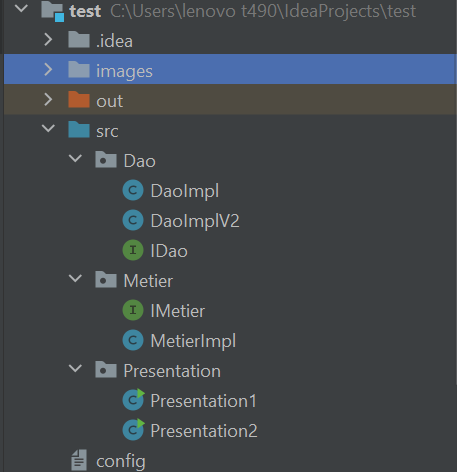

<h1>Rapport TP1</h1>

Architecture

Interface DAO

Implementation de l'interface DAO

Interface Metier

Implementation Metier

Instanciation statique

Instanciation dynamique

Resultat ImplDaoV1

Resultat ImplDaoV2

