<h1>Rapport TP1 (HAMZA HAIMEUR 4IIR G11)</h1>

Architecture

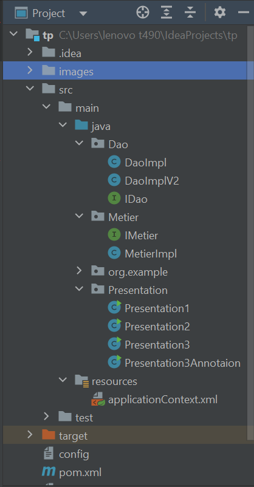

Interface DAO

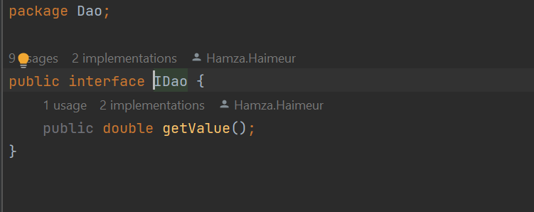

Implementation de l'interface DAO

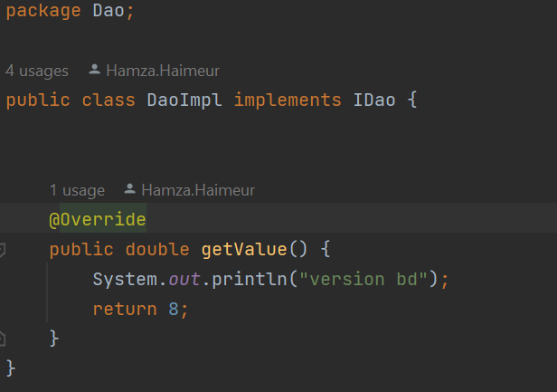

Interface Metier

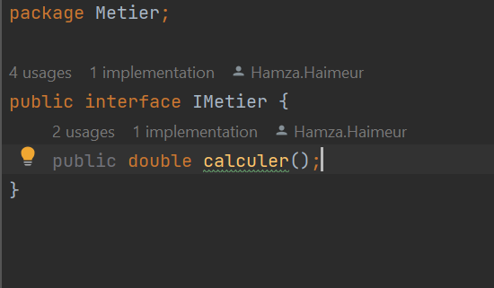

Implementation Metier

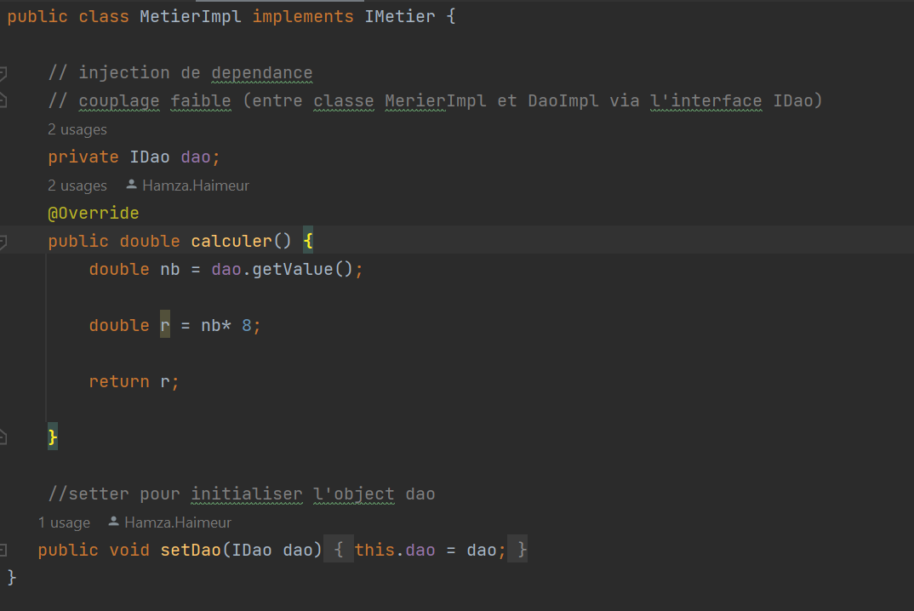

Instanciation statique

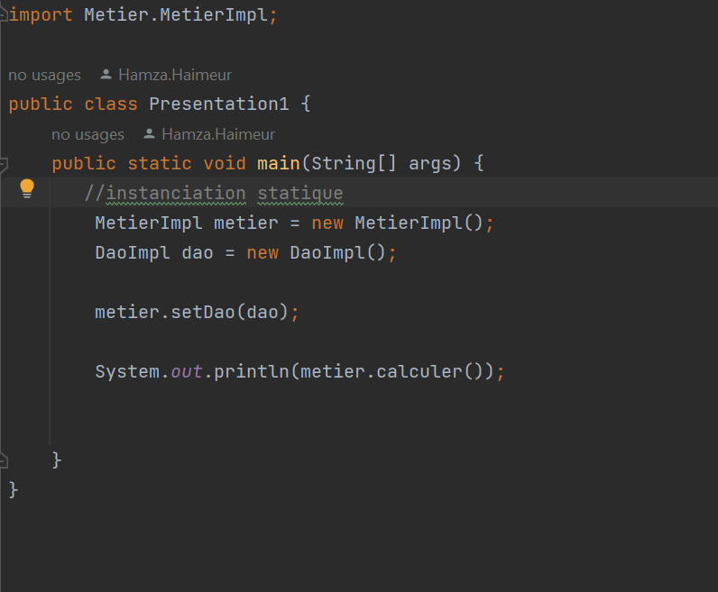

Instanciation dynamique

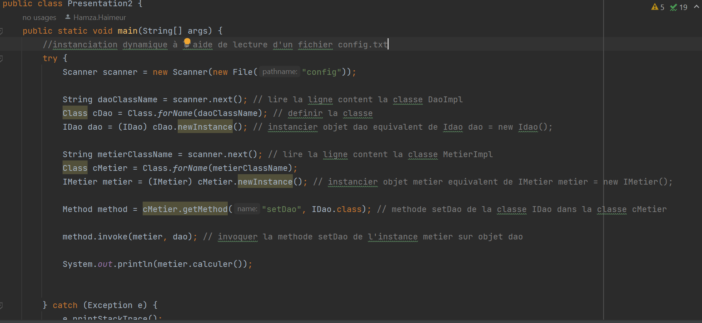

Resultat ImplDaoV1

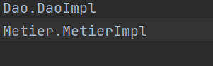
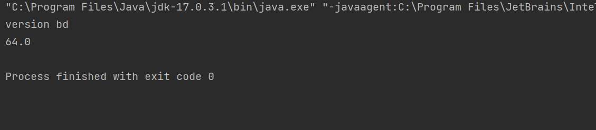

Resultat ImplDaoV2

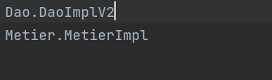
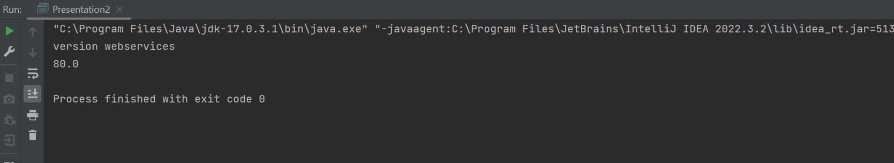

pom.xml avec depedances spring-context, spring-beans, spring-core

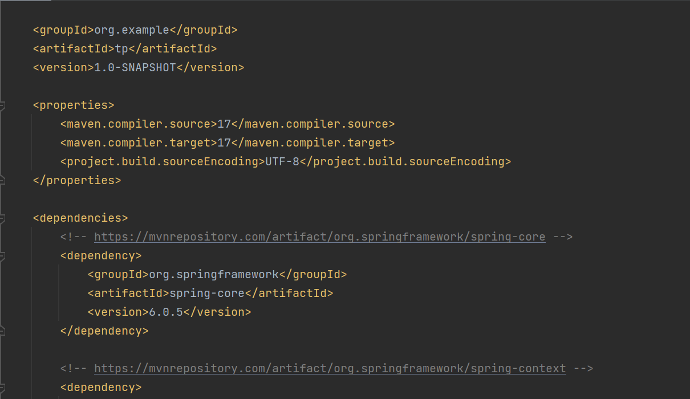

context d'application XML 

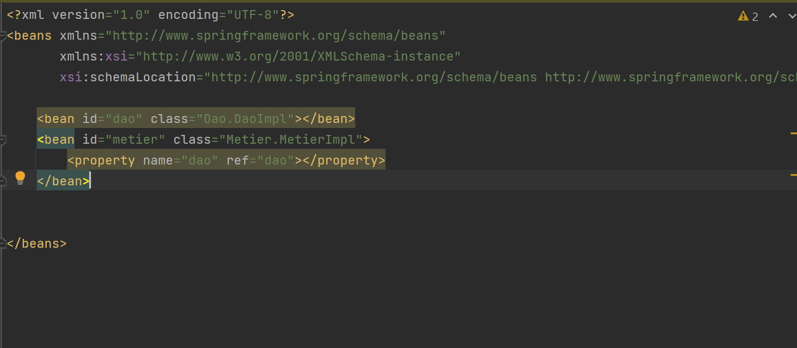

Presentation 3 XML 

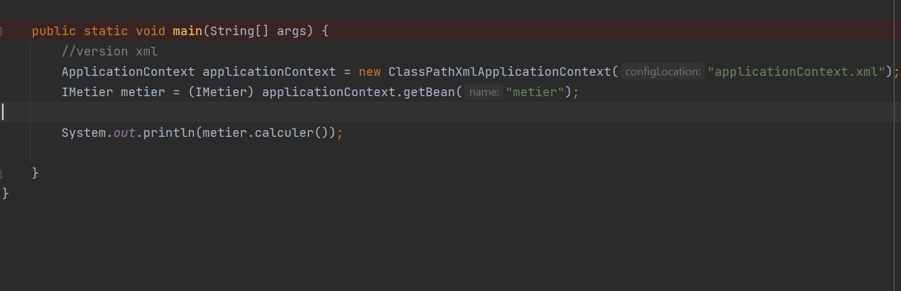

Component annotation

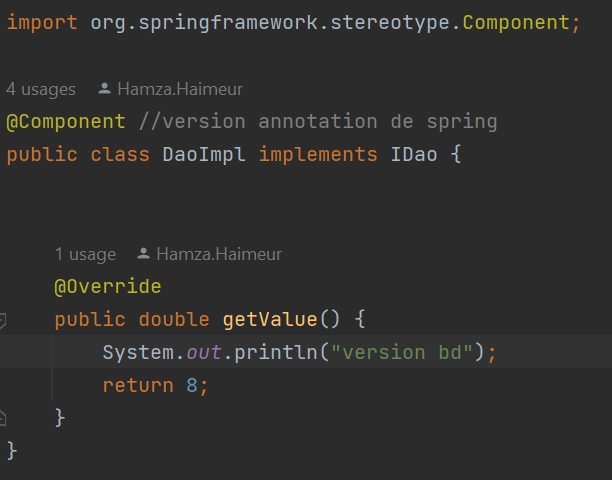

Autowired annotation

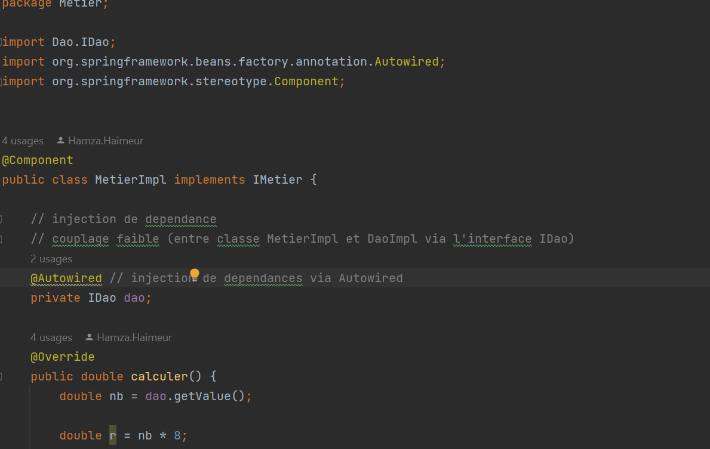

Presentation 3 Annotation 

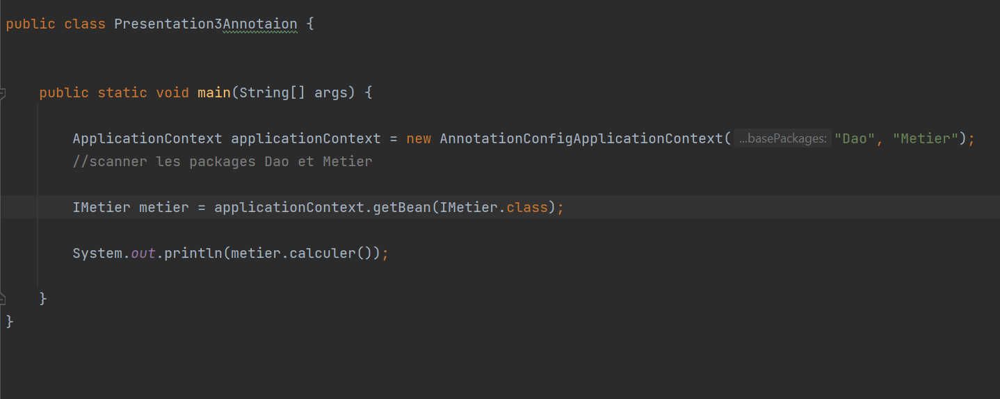

